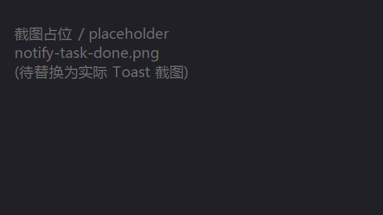
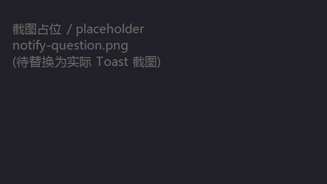
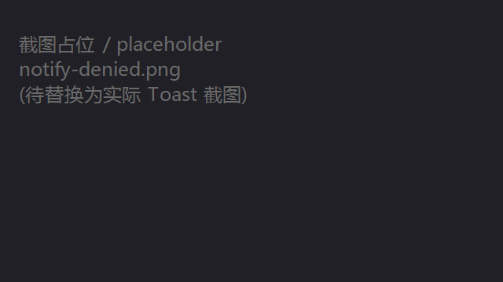
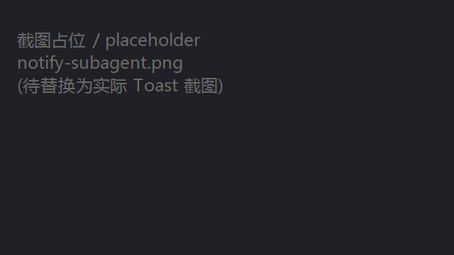
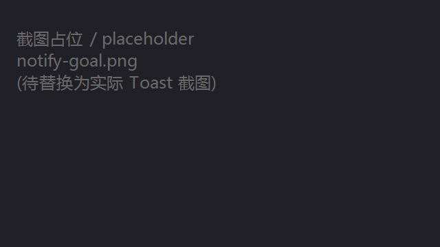

# DSH 桌面通知（dsh-desktop-notify）

为 [DSH](https://github.com/deepseek-ai/dsh) 打造的桌面通知插件（Windows / Linux），随 `dsh web` 启动自动加载（无需审批）。当前适配 **DSH 0.1.7-rc.2**（`jobs` 服务面、客户端会话快照等契约按该版本实现）。

- **任务完成**：agent 干完活回到空闲时，弹「✅ DSH 任务完成」+「工作区/会话名:结尾输出内容」
- **等待你回答**：AI 发起 `ask_user_question` 提问时，弹「❓ DSH 等待你的输入」提醒你回来
- **审批被自动拒绝**：`never` 审批政策下操作被静默拒绝时，弹「🚫 操作被自动拒绝」告知
- **后台任务结束**：后台子代理 / 目标完成或卡住 / 后台命令任务结束时逐一提醒
- **启动播报**：每次 `dsh web` 启动后推一条「插件启动成功:共有 N 个插件成功加载」；有插件没激活时改为列出它们的 id 与数量。每次启动只推一次
- **点击跳转**：会话类通知点击跳回对应会话，启动播报点击打开「插件」面板；没有跳转目标的通知点了只会消失
- **防打扰**：**只静默"你正在看的那个会话"**——页面聚焦且其中当前选中的正是这条通知所属会话时才不弹；切到别的窗口/标签、最小化，或者你正在看别的会话（多会话/多工作区并行），提醒照常推送
- **DSH图标**：Toast 右下角与应用身份图标均为 DSH Logo（透明底 PNG/ICO），非系统默认图标；**深浅两套**（深色主题白鱼 / 浅色主题黑鱼）按系统主题自动切换
- **原生直连发送**：Windows 用 [koffi](https://koffi.dev/) 直调 WinRT 发 Toast，Linux 直连 D-Bus（`org.freedesktop.Notifications`）——**无 Python、无子进程、无冷启动**（点击跳转在 Linux 上走 xdg-desktop-portal 的 OpenURI，同样不起子进程）

## 截图

| 任务完成 | 等待输入 | 审批被拒 |
| :---: | :---: | :---: |
|  |  |  |

| 子代理结束 | 目标完成/卡住 | 后台任务结束 |
| :---: | :---: | :---: |
|  |  |  |

## 安装

前置条件：**已启动过一次 `dsh web`**（需已生成 web profile）。不需要 Python、不需要 pip。

```powershell
# Windows
git clone https://github.com/Mvyvn/dsh-desktop-notify.git
cd dsh-desktop-notify
powershell -ExecutionPolicy Bypass -File scripts/install.ps1
```

```bash
# Linux（KDE / GNOME 等桌面会话，走 D-Bus 原生通知）
git clone https://github.com/Mvyvn/dsh-desktop-notify.git
cd dsh-desktop-notify
bash scripts/install.sh
```

脚本会把插件装入 `$DSH_HOME/profiles/web/node_modules/dsh-desktop-notify/`（`$DSH_HOME` 默认 `~/.dsh`），并把包名登记进 web profile 的 `dsh.profile.bundles`——**不写 `dependencies`**：npm 上有个同名的**另一个**插件（与本仓库、与本项目无关），写进 `dependencies` 会让任何一次 `npm install` 去 registry 拉那一个、把本地这份覆盖掉；代价是该 profile 里跑 `npm install` 会把这套手动安装的文件当 extraneous 清掉（重跑脚本即可恢复）。Windows 脚本还会：先确保运行时依赖 `koffi` 在 profile 中可用（缺失时 `npm install koffi`，装不上则从本仓库 `node_modules` 拷贝；**先装依赖再拷插件**，否则 npm 会把刚拷进去的插件清掉），并按**当前系统主题**写好 AUMID `DSH` 注册表键（Toast 顶部的程序应用图标来源；插件之后会随主题切换自动改写）。之后**完全重启 `dsh web`**（结束进程重开，不是刷新页面）。

验证：切到别的窗口，让 agent 跑一个小任务，完成后应弹出系统通知；**停在你正在看的那个会话**里则不弹——但如果你切去别的会话（或别的标签），它的提醒会照常弹（聚焦静止 2 分钟视为失焦，恢复提醒）。也可以直接跑冒烟测试：

```powershell
node scripts/winrt-probe.mjs    # Windows：注册 AUMID（按当前主题选图标）+ 发一条真实 Toast
node scripts/theme-probe.mjs    # Windows/Linux：模式检查 + 切换事件跟踪自检（不改系统主题）
node scripts/dsh-runtime-probe.mjs   # 把宿主半区挂进 DSH 自带的 cordis 跑一遍契约自检（不发真实通知）
```

```bash
# Linux：发一条通知（桌面会话里执行；纯 SSH/无桌面会话不会弹）
node --input-type=module -e "import('./lib/toast-linux.js').then(m => m.sendToast({ title: 'DSH 通知测试', message: 'D-Bus 直连可用' }))"
```

## 通知一览

| 通知 | 触发钩子 | 静默判定用的会话 | 正文格式 |
| --- | --- | --- | --- |
| ✅ 任务完成 | `agent/status` running→idle（仅根 agent，3 秒去抖） | 该 agent 的会话 | 工作区/会话名:结尾输出内容 |
| ❓ 等待你回答 | `tools/execute` 捕获 `ask_user_question` 派发 | 发起提问的会话 | 工作区/会话名:[类型] 内容 |
| 🚫 审批被自动拒绝 | `session/event` 流 `approval/asked`+`decided` 审计对 | 被拒操作所在会话 | 工作区/会话名:工具名-拒绝原因 |
| 🤖 后台子代理结束 | `subagent/end` | 主会话或子会话 | 工作区/主会话名:子代理名已完成 |
| 🎯 目标完成 / 阻塞 | `goal/changed` | 目标所属会话 | 工作区/会话名:目标-已完成 / 目标-阻塞原因 |
| 🧰 后台任务结束 | `jobs.events` 的 `settled` 事件（0.1.7 起 `onJobDone` 已移除；`kind='subagent'` 的 job 由上一行负责，不重复弹） | owner 会话（取不到则不静默） | 工作区/会话名:后台任务名已完成/失败/被终止 |
| 🚀 启动播报 | 插件 `apply` 后等组合稳定（`loader.await()`）数一遍插件行 | 无（始终推送） | 插件启动成功:共有 N 个插件成功加载 / 有 N 个插件启动失败:加载失败的插件为 a、b |

前缀的"工作区"按会话动态解析（多工作区并行时各显示自己的工作区名），"会话名"取 `sessionTitle` 服务。门控只比对会话，不影响文案。
`awaited === true` 的结算（有调用方在等、结果已交给它）不通知；后台一次性子代理既是 `subagent/end` 又是 `kind='subagent'` 的 job，只由 `subagent/end` 报一次。

## 给其它插件调用（对外 API）

本插件把自己注册成 Cordis 服务 `desktopNotify`，**你自己的插件可以直接调用它推送通知**：

```js
// 在你的插件里（宿主半区 apply）
export function apply(ctx) {
  const desktopNotify = ctx.get('desktopNotify')   // 可选服务：本插件未加载时为 undefined
  if (!desktopNotify) return

  // 1) 走聚焦门控：只有"你正在看的那个会话"会被静默
  desktopNotify.push({
    title: '构建完成',
    message: '工作区/会话:全部通过',
    urgency: 'normal',      // 'low' | 'normal' | 'critical'，缺省 normal
    sessionId: agent.session, // 可选：传了就按会话门控；不传则始终推送
  })

  // 2) 绕过聚焦门控：无论页面是否聚焦、正在看哪个会话，都弹
  desktopNotify.pushAlways({ title: '磁盘告急', message: '剩余 1GB', urgency: 'critical' })

  // 3) 想要明细（是否真的入队/是否被静默/原因）用 notify()
  const result = desktopNotify.notify({ title: '构建完成', sessionId: agent.session })
  // { ok: true, queued: false, silenced: true, reason: 'silenced' }

  // 4) 点击跳转：url 可选；不传时按 sessionId 自动生成"跳回该会话"的链接
  desktopNotify.push({ title: '构建完成', sessionId: agent.session })
  desktopNotify.push({ title: '打开文档', url: 'https://example.com/doc' })   // 只接受 http/https
}
```

- 返回 `true` 表示**真的入队了**；被聚焦门控静默、命中同文案去重（1.5 秒窗口）、或当前平台没有通知后端时都返回 `false`（想区分原因用 `notify()`，它在载荷无效时返回 `{ ok: false, reason: 'invalid-payload' }`）。**标题为空一律 `false` 且不推送**（避免空通知）。`pushAlways` 是"强制弹"：既不看门控也不进去重窗口。
- `title` 最长 160 字符、`message` 最长 400 字符，超出截断（不会切断 emoji 这类代理对）；队列仍按 200ms 间隔逐条发送，队列上限 32 条（超出丢最旧的）。
- `sessionId` 可传会话对象、会话 id 或它们的数组（子代理场景可同时传主会话与子会话）。`url` 是**点击通知要打开的地址**（只接受 http/https）；不传 `url` 但传了 `sessionId` 时，宿主自动生成"跳回该会话"的链接；两者都没有则通知不可点击。
- 想全局取用可写 `inject: ['desktopNotify']`（硬依赖，本插件缺失时你的插件不会加载）；否则用 `ctx.get` 按可选服务处理。

## 项目结构

```
dsh-desktop-notify/
├── lib/          # 宿主端 index.js（门控/队列/平台分发）+ gate.js（按会话门控）+ api.js（对外推送 API）
│                 # 发送层：winrt.js（Windows / koffi 直调 WinRT）、toast-linux.js（Linux / D-Bus 直连）
│                 # 主题：theme.js（状态+平台分发）、theme-win32.js（注册表+变更事件）、theme-linux.js（portal+信号）
│                 #       theme-codec.js（判定纯逻辑）、icons.js（按主题选图标）
│                 # 基础设施：dbus.js（常驻会话总线：Hello/调用/信号）、win32-registry.js（注册表+等待句柄）
│                 #             state.js（有界容器+去重）、text.js（截断）、client.js（浏览器端聚焦/会话上报）
├── assets/       # 通知图标：dsh-dark.{png,ico}（白鱼/深色主题）、dsh-light.{png,ico}（黑鱼/浅色主题）
│                 #             dsh.{png,ico} 为旧路径兼容副本
├── scripts/      # 安装脚本 install.ps1 / install.sh、语法自检 check-syntax.mjs
│                 # 冒烟测试 winrt-probe.mjs（真发一条 Toast）、theme-probe.mjs（主题检查+切换事件）
│                 # 契约自检 dsh-runtime-probe.mjs（把宿主半区挂进 DSH 自带的 cordis 真跑一遍）
│                 # 图标生成 make-icon.py（开发期换图用，需 Python）
├── tests/        # node --test 单测（宿主集成事件流 / 浏览器半区 / 聚焦门控 / 对外 API
│                 #                / D-Bus 编组与解码 / 主题判定 / 图标解析 / 有界容器 / 文本截断）
├── docs/         # 架构、原理、上手文档
├── screenshots/
├── cordis.patch.yml
└── package.json
```

## 工作机制与限制

- **聚焦门控（按会话，事件驱动零轮询）**：浏览器半区（`lib/client.js`）通过官方 Connection RPC 通道 `/dnotify` 上报"页面是否聚焦"以及"该页面当前选中的会话"（取 harness 客户端 `sessions` 快照里"被主视图保留"的那个会话——`byId[*].retainedBy.mainView`，与官方 ui-layout/ui-session 同一判据，会话切换即时重报）——聚焦判定为 `visibilityState === 'visible' && document.hasFocus()`，由 `focus`/`blur`/`visibilitychange`/`pagehide` 原生事件即时触发（页面关闭经 `keepalive` 可靠上报失焦）；聚焦页面上的用户活动（键盘/鼠标/滚动，节流 10 秒）保持"保鲜"，另有 1 分钟聚焦心跳，避免"看着但不动鼠标"被保鲜超时误判为失焦。宿主端按"页面 × 会话"聚合（`lib/gate.js`）：**只有存在聚焦页面、且该页面选中的会话正是通知所属会话时才静默**；正在看会话 A 时，会话 B 完成照样弹。**拿不到会话归属的通知**（例如 owner 已清理的后台任务）一律推送，不静默。聚焦静止超 2 分钟视为失焦，异常关闭残留的页面条目 10 分钟自动清理。
- **发送层（原生直连，无子进程）**：`lib/index.js` 按平台动态加载发送层（win32 之外不会 import koffi）。
  - **Windows（`lib/winrt.js`）**：koffi 直调 WinRT（`ToastNotificationManager` → `ForUser` → `CreateToastNotifierWithId('DSH')` → `XmlDocument.LoadXml` → `Show`），不拉起任何 Python/子进程；首次发送前幂等写入 `HKCU\SOFTWARE\Classes\AppUserModelId\DSH`（`DisplayName` + `IconUri`）供通知中心显示图标。
  - **Linux（`lib/toast-linux.js`）**：纯 JS 直说 D-Bus 协议（`$DBUS_SESSION_BUS_ADDRESS` 或 `/run/user/<uid>/bus`，SASL EXTERNAL 握手 → `Hello` 注册 → 调 `org.freedesktop.Notifications.Notify`），不调用 `notify-send`；连接常驻复用、断开自动重连（失败冷却 30s、错误去重），标题/正文/图标/urgency 都随方法参数发出。`Hello` 是总线强制步骤：没它就连 AddMatch/信号订阅都做不了（主题跟踪正需要）。
  - 两平台共用同一条发送队列：200ms 间隔防轰炸，发送失败单次重排队，队列上限 32 条。
- **主题与图标**：通知背景跟随系统深浅色，而图标不会被反色，所以随包带两套透明底图标（`dsh-dark.*` 白鱼 / `dsh-light.*` 黑鱼）。`lib/theme.js` 启动时读一次、之后跟踪切换事件：**Windows** 读 `HKCU\...\Themes\Personalize\SystemUsesLightTheme`（缺失退 `AppsUseLightTheme`），用 `RegNotifyChangeKeyValue` 异步事件 + 2 秒非阻塞句柄检查拿到切换通知；**Linux** 读 xdg-desktop-portal 的 `org.freedesktop.appearance/color-scheme`，订阅同接口的 `SettingChanged` 信号（portal 不可用时退环境变量启发式）。两条通道都可能不可用（策略/权限/无 portal），因此都挂一个 60 秒兜底重读；主题变化还会顺手改写 AUMID 图标，让通知中心的应用图标同步换色。
- **点击跳转**：宿主把"点击"变成打开 `http://127.0.0.1:<端口>/dnotify/click?t=<进程令牌>&target=<目标>`——那是一个只记录目标的小落地页；已打开的 DSH 页面通过 SSE（`/dnotify/events`）立刻收到目标，再用 `/dnotify/claim` 认领（**先到先得，宿主只放行一个页面**），所以多页面并存时只切一个，切的是"你已经在用的那个页面"。
  - **会新开一个浏览器标签页**（落地页）：这是系统打开 URL 的固有行为，浏览器也拒绝脚本关闭它，插件不做规避（1.6.1 试过"自定义协议 + 一跳转发进程"，用户判定低效，1.6.2 已移除）。
  - **Windows**：Toast 用 `activationType="protocol"` + `launch=URL`，由系统交给浏览器打开（不需要注册 COM 激活器）；不设 URL 的 Toast 是普通通知（点击只消失）。
  - **Linux**：带 URL 的通知声明 `default` 动作并等 `Notify` 返回的 id；点击后收到 `ActionInvoked` 信号，再用 xdg-desktop-portal 的 `OpenURI` 打开（不起子进程；portal 不可用时只记一条日志）。
  - 目标：**会话类通知** → `session:<会话 id>`，客户端用公开服务 `ctx.get('uiWorkspace').openSession(id)` 就地切换（与点侧栏会话行同一条链路；**子代理**会话按 ui-workspace 的规则进子代理界面，**后台任务**回到它的主会话）。**启动播报** → `page:settings-plugins`：先合成 ⌘/Ctrl+, 打开「设置」再点「内置插件」导航格；打不开设置就退回**插件面板**（`pluginNavigation.openBundle`）。没有跳转目标的通知点击只消失。
  - 旧的 `#dsh-notify=<目标>` 形式仍兼容（手动打开、或 SSE 不可用时的退路）。
- **启动播报（每次启动一次）**：插件 `apply` 后等组合稳定，数一遍 `ctx.get('loader')` 里的插件行——`fiber.state` 为 ACTIVE 的算加载成功，FAILED / 没有 fiber / 等不来服务的一律算"没加载起来"并列出 `entry.options.id`；主动 `disabled` 的行不计入。数不出来（没有 loader 服务）就静默跳过。进程级标记放在 `globalThis`，热更新重复 apply 不会重播。
- **消息缓存**：仅缓存"最近一条助手回复摘要"（≤220 字符），任务完成通知消费后即释放；按会话/按 id 的缓存全部**有界**（摘要 128 条、审批配对 64 条、提问时刻 32 条，超出淘汰最旧），常驻进程不会随会话数增长；**同来源同文案** 1.5 秒内只弹一次（事件重复派发或失败重投时不连弹；去重键 = 标题 + 正文 + 来源 id + 会话归属，所以两个同名后台任务、两个并行会话的同类提醒都各弹各的）；重启自动初始化。
- **`never` 政策下的审批通知**：`approval/request` waterfall 在 `never` 政策下不会派发，因此插件改从会话日志的 `approval/asked`/`approval/decided` 审计对获取被拒记录。想收到这类通知请保持审批政策为 `never`。
- **通知图标**：Toast 的 appLogoOverride 只接受 PNG/JPG/GIF（不支持 SVG），插件随包携带四张图（`assets/dsh-dark.png|ico` 白鱼、`assets/dsh-light.png|ico` 黑鱼，由 `scripts/make-icon.py` 从 DSH favicon 一次栅格化；该脚本只是开发期换图工具，装插件时不需要跑，也不需要 Python），发送时按当前系统主题挑一套；旧路径 `assets/dsh.png|ico` 保留为深色（白鱼）版本的兼容副本。Toast 顶部/通知中心的程序应用图标来自 AUMID `DSH` 的注册表键 `IconUri`（只写 DSH 自己的键），同样随主题改写。
- 依赖系统桌面通知后端：Windows Toast 由 WinRT 提供，Linux 由桌面会话的 D-Bus 通知服务（KDE/GNOME 等）提供；Windows **专注助手/勿扰模式**、Linux 的勿扰开关都可能吞掉通知。
- **平台**：Windows 已实测（Windows 11）；Linux 走 D-Bus（Kubuntu/KDE、Ubuntu/GNOME 等桌面会话；无桌面会话的纯 SSH 环境不会弹通知），D-Bus 编组有单测覆盖；macOS 后端暂未实现（会加载但只记录一条"无后端"提示）。
- **调试日志开关**：默认关闭，终端不输出 `[dsh-desktop-notify]` **状态**日志。排查时可在 profile 的 `cordis.patch.yml` 中覆盖 `desktop-notify` 行开启（`config: { debug: true }`），重启后终端会输出 notify 决策/聚焦上报/fire/job settled/主题等状态日志。**错误**日志不受开关限制：发送失败、D-Bus 连接错误、钩子异常、无通知后端提示都照常打印。

## 许可证

[MIT](LICENSE) © 2026 沐云 (Mvyvn)
